# GenStyles

**GenStyles** is a generative AI-powered e-commerce platform designed to revolutionize the online shopping experience. This project leverages advanced technologies to provide a seamless, intuitive, and personalized shopping experience.

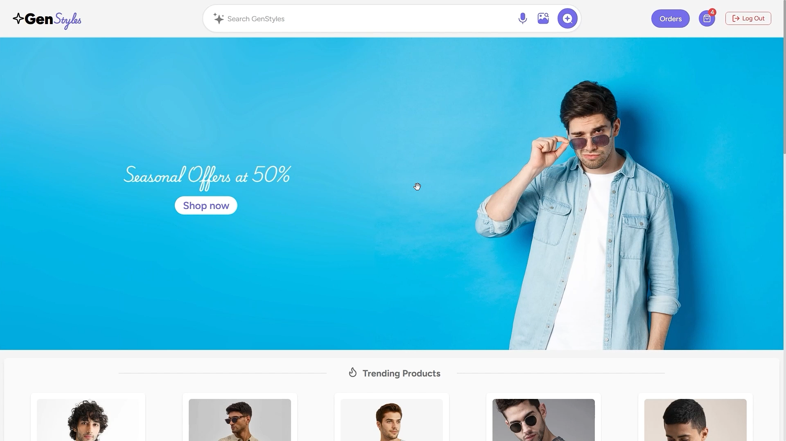

## Features

- **Modern and Intuitive Design**: Clean layout with a calming color palette for a seamless shopping experience.
- **AI-Powered Search**: Supports text, voice, and image-based queries for user convenience.
- **Engaging Product Display**: High-quality visuals with detailed product information and clear CTAs in a grid layout.
- **Personalized Recommendations**: Tailored shopping suggestions based on purchase and viewing history using Azure OpenAI ChatGPT.
- **Similar Products**: Suggests visually and descriptively similar products to help users discover related items.
- **Real-time Voice Search**: Powered by Azure Speech Services for accurate speech-to-text conversion.
- **Image Search**: Allows users to upload images and find matching products instantly using AI-driven image search.

## Tech Stack

- **Frontend**: ReactJS
- **Backend**: Node.js
- **Database**: MongoDB
- **Cloud Services**: Azure (Azure OpenAI, Azure Speech Services)

## Repositories

- **Frontend Repository**: [GenStyles Frontend](https://github.com/theSumanth/gen-styles-client.git)
- **Backend Repository**: [GenStyles Backend](https://github.com/yusufali04/gen-styles-backend.git)

## Installation

### Frontend

1. **Clone the frontend repository**:

   ```bash
   git clone https://github.com/theSumanth/gen-styles-client.git
   cd gen-styles-client
   ```

2. **Install frontend dependencies:**:

   ```bash
    npm install
   ```

3. **Run the frontend application:**:
   ```bash
    npm run dev
   ```

### Backend

1. **Clone the backend repository**:

   ```bash
   git clone https://github.com/yusufali04/gen-styles-backend.git
   cd gen-styles-backend
   ```

2. **Install backend dependencies:**:

   ```bash
    npm install
   ```

3. **Set up environment variables for the backend: Create a .env file in the root directory and add your configuration settings:**:

   ```env
   PORT=
   NODE_ENV=
   MONGODB_CONNECTION_URL=
   CHATGPT_API_KEY=
   CHATGPT_ENDPOINT=
   JWKS_URI=
   AZURE_AI_SEARCH_ENDPOINT=
   AZURE_AI_SEARCH_API_KEY=
   AZURE_AI_SEARCH_INDEX_NAME=
   ```

4. **Run the backend application:**:

   ```bash
    npm run dev
   ```

## Usage

- **Homepage**: Browse through a modern and intuitive interface.
- **Search**: Use text, voice, or image-based queries to find products.
- **Product Display**: View high-quality visuals and detailed product information.
- **Recommendations**: Get personalized product suggestions based on your browsing and purchase history.
- **Similar Products**: Discover products similar to the ones you are viewing.
- **Cart**: Add products to your cart and proceed to checkout.

## Demo video

- Check out our demo video to see GenStyles in action: [Demo link](https://drive.google.com/file/d/1Gy_9cUu3aimmDEHiMLPSkOu0o49qLiPG/view?usp=sharing)

## Credits

- **Frontend Development**: [Sumanth Bojugu](https://github.com/theSumanth)
- **Backend Development**: [Yusuf Ali](https://github.com/yusufali04)

## Acknowledgements

- Product catalog data from Myntra used solely for research and demonstration purposes.

## Output Screens

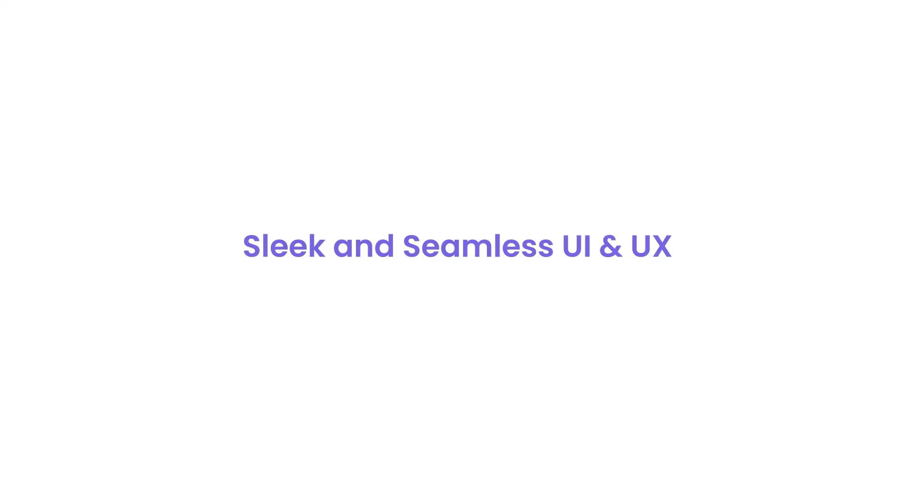


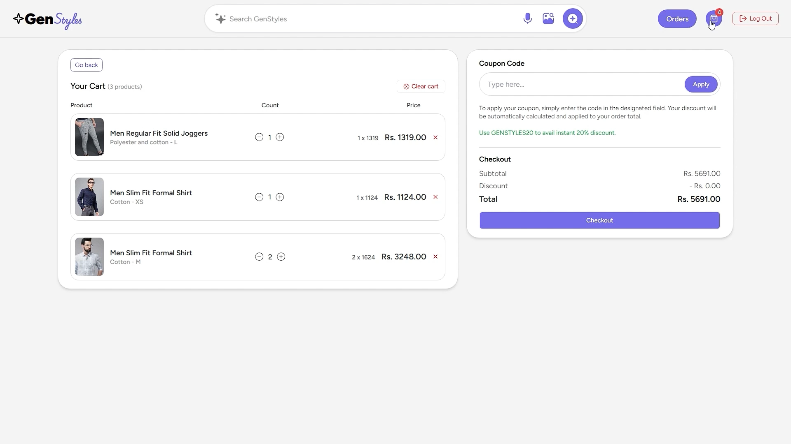

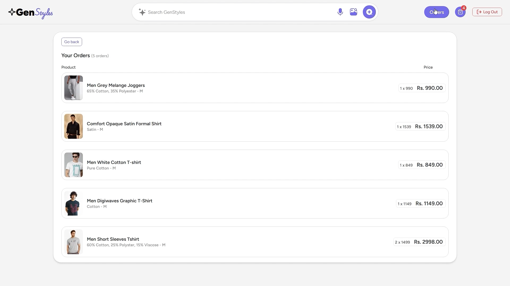

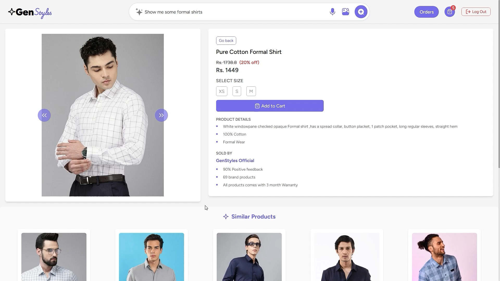

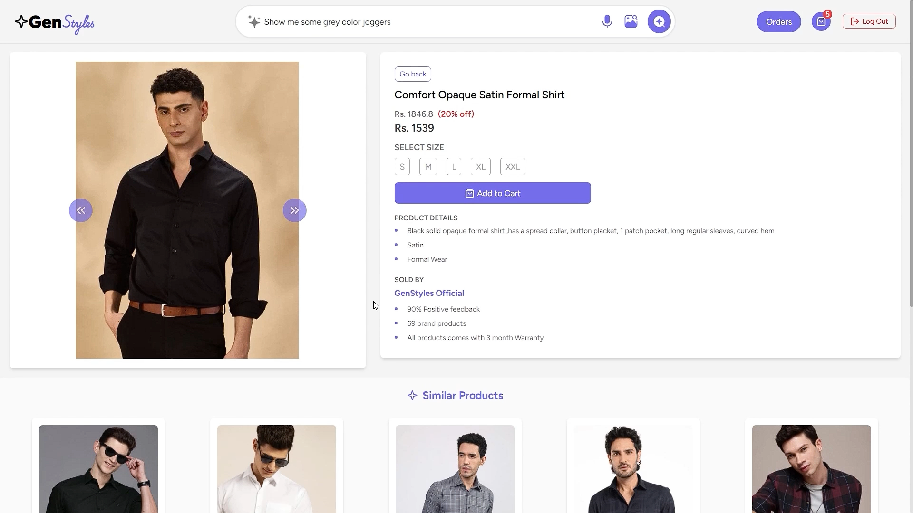


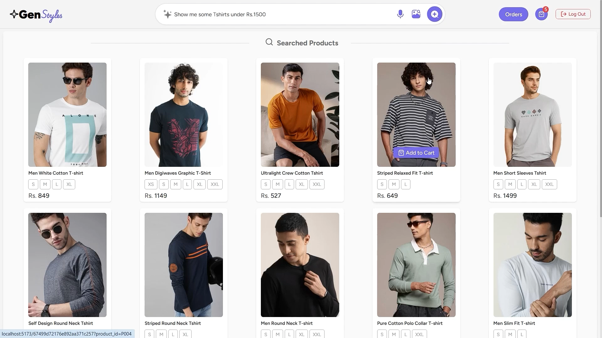

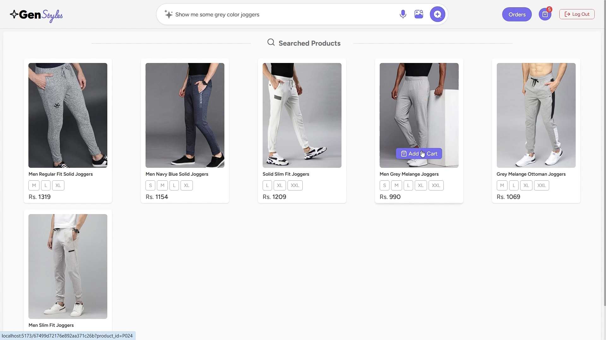


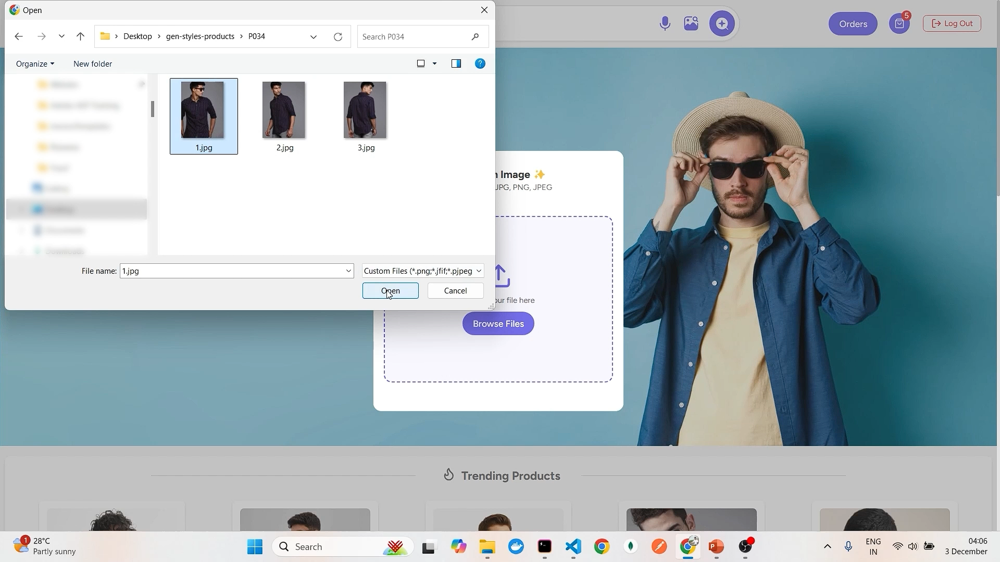

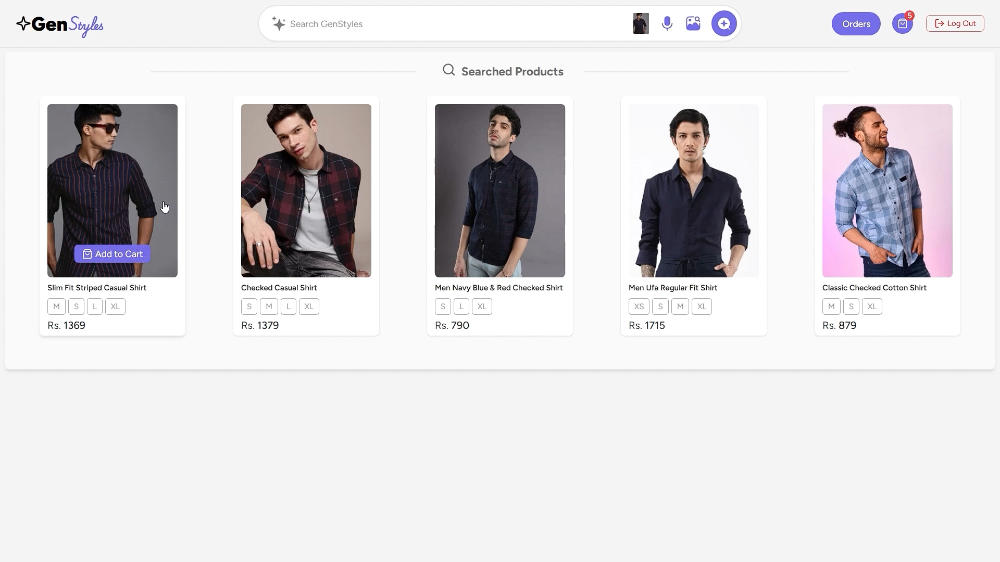

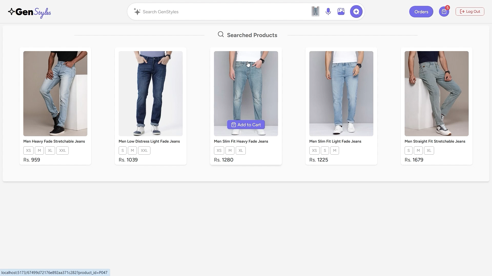

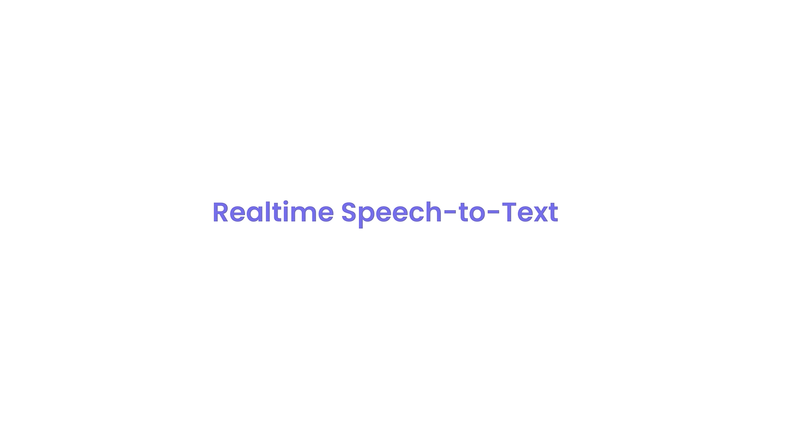

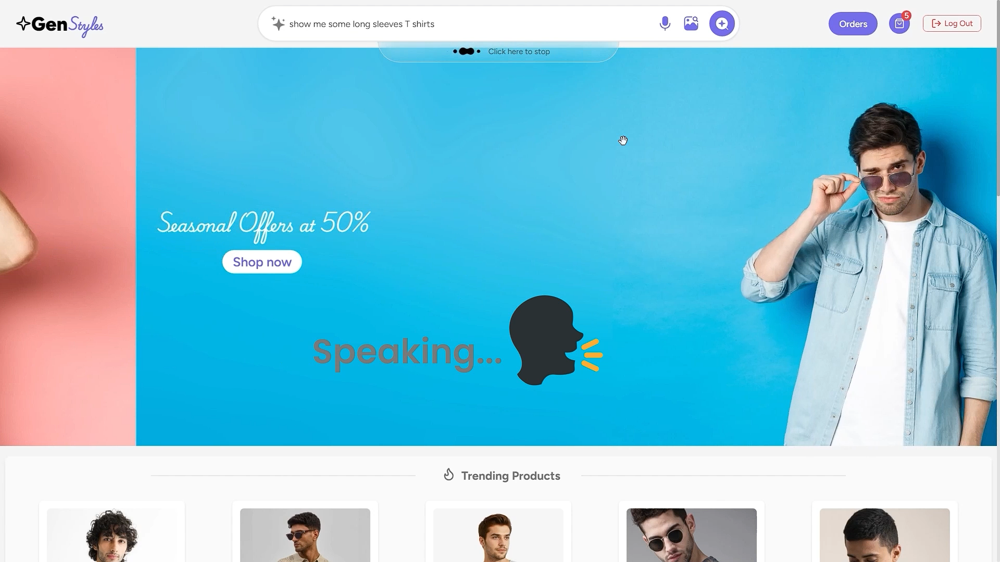

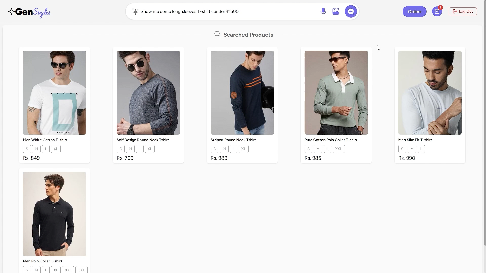
